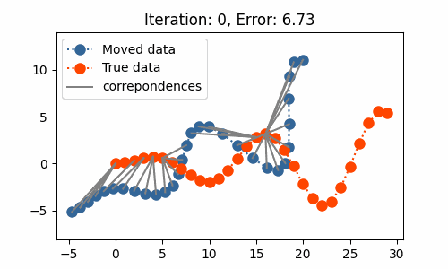
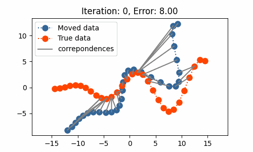

# ICP Algorithm Implementation

## Overview
This repository contains a simple yet effective implementation of the Iterative Closest Point (ICP) algorithm, which is widely used in the field of computer vision and robotics for aligning point cloud. This project includes two primary methods of ICP:

1. **SVD-based ICP:** This method utilizes Singular Value Decomposition (SVD) for aligning point clouds.
2. **Non-linear Least Squares ICP:** An implementation that uses a non-linear least squares optimization technique.

## Features
- Efficient and accurate implementation of ICP algorithms.
- Visualization of the alignment process with GIF animations.
- Easy-to-understand code structure suitable for educational purposes or further development.

## Visualization

### Non-linear Least Squares ICP

### SVD-based ICP

## Getting Started
To run this project, simply clone the repository and jump into the source code of the icp.ipynb file. Ensure you have all the required dependencies installed.

## Dependencies
- Python 3.x
- NumPy

## Completed Tasks
- [x] SVD-based ICP
- [x] Non-linear Least Squares ICP

## TODO Lists 
- [ ] Point-Plane ICP
- [ ] Apply such methods to 3D point cloud registration. Current methods are applied to 2D point cloud registration. 

## Reference
- [ICP & Point Cloud Registration Youtube Tutorial (Cyrill Stachniss, 2021)](https://www.youtube.com/watch?v=CJE59i8oxIE&t=3226s)
